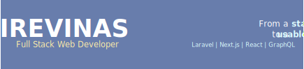

## About me
Full Stack Web Developer experienced in both backend logic and frontend development. Skilled with Laravel, Next.js, React.js, Node.js, and GraphQL, with experience in microservices and multitenant architectures.

Focused on building scalable, efficient platforms with strong attention to usability and user experience. Quick to learn new languages, frameworks, and environments, delivering solid and innovative solutions with an emphasis on quality and performance.

## Skill Set
These are some of the major technologies that I use or have worked on in the past

### 🟨 Front End 

### 🌐 Back End

### 🎨 Style and Design  

### 🗄️ Databases

### 🛠️ Tools

  